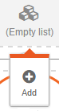

# An editable menu

The previous chapters showed how to create your own design and make it editable. This chapter expands on that and shows how to make your site's menu editable as well.

Most navigation menu's look something like this, in HTML:

```html
<nav>
    <ul class="nav">
        <li>
            <a href="/index.html">Home</a>
        </li>
        <li>
            <a href="/page2.html">Page 2</a>
        </li>
    </ul>
</nav>
```

Using the same trick as in the previous chapter would turn this into:

```html
<nav>
    <ul class="nav">
        <li>
            <a href="/index.html" data-simply-field="menu1">Home</a>
        </li>
        <li>
            <a href="/page2.html" data-simply-field="menu2">Page 2</a>
        </li>
    </ul>
</nav>
```

This will work, but there is a problem: You can't remove a menu item, or add a new one. You can only change the menu items that are there.

##data-simply-list

Instead, we'll use a new trick: `data-simply-list`.

```html
<nav>
    <ul class="nav" data-simply-list="Main Menu">
        <template>
            <li>
                <a href="/index.html" data-simply-field="item">Menu item</a>
            </li>
        </template>
    </ul>
</nav>
```

We've added a new attribute and a `<template>` tag.

The `data-simply-list` attribute tells SimplyEdit that the contents are a list of things. But SimplyEdit doesn't know what is in these things, unless you tell it. This is where the `<template>` comes in. 

SimplyEdit sees the template tag, and takes its contents and applies it to each element in the list. Just as if each element was a separate page.

So you can use a `data-simply-field` inside a list template, just like on any other tag in the page.

If the list is empty, nothing is shown. Only when you are editing the page, you'll see a message like this in the place of the empty list:


If you click or touch it, a toolbar will appear:



Now press the add button and you will see 'Menu item' appear and the (Empty list) message disappears.

In addition you'll see an icon above and to the left of the new menu item, like this:


It will appear almost transparent until you hover the mouse over the menu item, or touch it. If you press the icon, you get a new toolbar like this:


Pressing 'Add' inserts a new menu item, pressing 'Delete' removes it again. You now have a way to create as many menu items as you like, and remove them again later.

##data-simply-path

There is one problem though: Each page has its own menu, if you edit the menu on page a, the menu on page b won't be changed. To fix that SimplyEdit has another attribute `data-simply-path`.

```html
<nav>
    <ul class="nav" data-simply-list="Main Menu"
    data-simply-path="/index.html">
```

The path is normally automatically retrieved from the URL of the page you are editing. But in the case of the menu, you want the same menu on every page. The `data-simply-path` makes sure that the main menu is shared by all pages. The content for the Main menu is now always saved to and retrieved from the main page.

If you save the page, the `data.json` file will contain something like this:

```js
{
    "/index.html" : {
        "Page Title": "Your page title.",
        "Page Body": "<p>Your page contents.</p>",
        "Main Menu": [
            {
                "item": {
                    "href": "/index.html",
                    "contents": "Menu item 1"
                }
            }
            {
                "item": {
                    "href": "/page2.html",
                    "contents": "Menu item 2"
                }
            }
        ]
    }
}
```

SimplyEdit knows that "Main Menu" is a list. Because of the `<template>`, it also knows that each element of the list has a field called `item` and that this field is an anchor tag. So SimplyEdit stores the `href` attribute and the contents of each item as well.

##data-simply-sortable

The final trick is the `data-simply-sortable` attribute. If you add this attribute to a list, SimplyEdit will allow you to reorder the list using drag and drop.

```html
<nav>
    <ul class="nav" data-simply-list="Main Menu"
    data-simply-path="/index.html" data-simply-sortable>
```

Start the editor and press-and-hold or touch-and-hold a list item. The item will slant a bit to tell you that it is ready to be moved. Then drag it around and drop it where you want.

The editor is smart about it, it only allows dragging the item in a direction that is useful. So a menu is usually only draggable horizontally, sidebar menu's only vertically. Very rarely its both. SimplyEdit will figure this out itself, you don't need to do anything for this.

