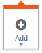
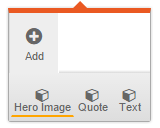

# Slice your content

The previous chapter showed how to use `data-simply-list` to build a main menu. This chapter will show some more uses for lists.

Lists are a very powerful feature in SimplyEdit. By using lists well, your website will be easy to edit and look good.

There are many design elements that lend themselves to lists. We've already show how to build a menu using lists. But you can also use it to show a slide show, show a portfolio or a list of employees. Or you can even use it to create modern responsive websites using 'content slices'.

A content slice is a horizontal section of your web page, that has its own design and responsive behaviour. These slices can be re-used on many pages and you can use many and different slices on a single page.

SimplyEdit makes editing content slices easier than ever.

The following example uses a design with three different content slices: A full width hero image, a quote and a text slice with a title.

The HTML that came from your design looks something like this:

```html
<body>
    <header>
        <div class="constrain-width">
            <h1>Page title</h1>
        </div>
    </header>
    <div class="slices">
        <div class="hero">
            
        </div>
        <div class="quote">
            <div class="constrain-width">
                <blockquote>An inspirational quote</blockquote>
            </div>
        </div>
        <div class="text">
            <div class="constrain-width">
                <h2>A subtitle</h2>
                <p>And some text</p>
            </div>
        </div>
    </div>
```

The class `constrain-width` makes sure the contents don't grow wider than, say, 960 pixels. The here image is meant to go full width, so it doesn't have this class.

Now we turn this into a list. But there is one problem. The list is not a list of one thing. There are three things that can be in this list.

No problem, we'll just make three templates:

```html
<body>
    <header>
        <div class="constrain-width">
            <h1 data-simply-field="Page title">Page title</h1>
        </div>
    </header>
    <div class="slices" data-simply-list="Content"
    data-simply-sortable>
        <template data-simply-template="Hero Image">
            <div class="hero">
                
            </div>
        </template>
        <template data-simply-template="Quote">
            <div class="quote">
                <div class="constrain-width">
                    <blockquote>An inspirational quote</blockquote>
                </div>
            </div>
        </template>
        <template data-simply-template="Text">
            <div class="text">
                <div class="constrain-width">
                    <h2 data-simply-field="subtitle">A subtitle</h2>
                    <div data-simply-field="text">
                        <p>And some text</p>
                    </div>
                </div>
            </div>
        </template>
    </div>
```

And you're done. If you edit the page now, you'll see an empty list again. But if you press it, the 'Add' button now has a little arrow below it:



If you press it, your templates will show up:



We've added a `data-simply-list` named 'Content'. This list has three templates. To tell them apart, we've given them each a name with the `data-simply-template` attribute.

